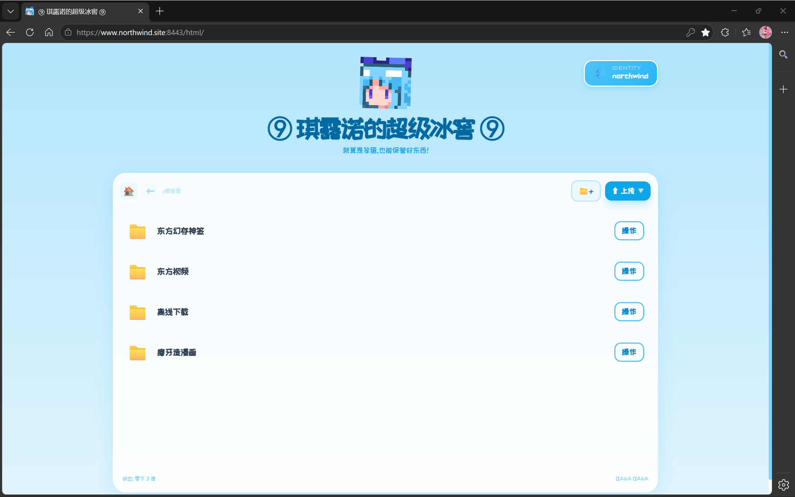
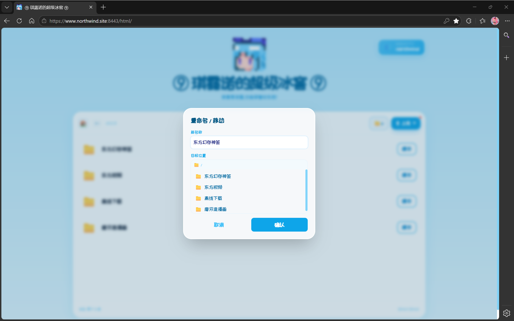
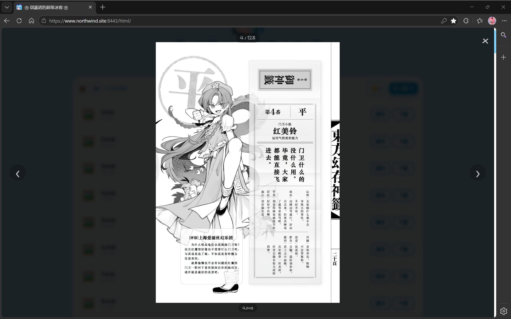
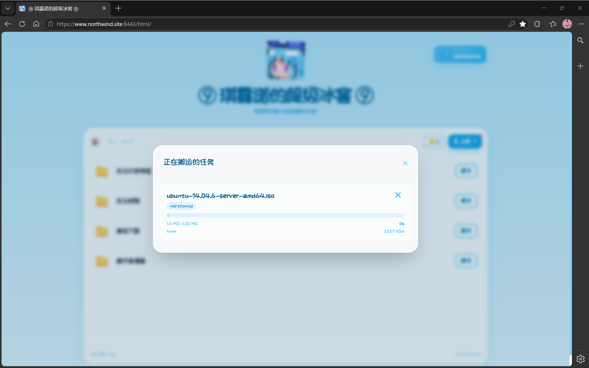

# baka-web-file-server · 漫画版（manga）

> **⚠️ 本分支会改写原始图片文件。** 漫画版为了缩略图缓存,会把内容哈希写入图片自身的元数据（PNG `tEXt` chunk / JPEG `APP9` 段）。改写是原子的、不改变图像像素,但文件字节和修改时间会变,且不可逆。**不接受请用 [`main`](../../tree/main)。**

---

一个轻量、无状态的自托管文件服务器。基于 HTTPS + JWT,提供 RPC 风格的 API,支持文件上传、远程 URL 下载和进度追踪。附带开箱即用的 Web 界面,部署简单。

类似 filebrowser,但完全独立实现。后端由我完成,前端约 40% 由 AI 生成。

漫画版在主线全部能力之上,叠加了针对漫画浏览的缩略图与渐进式加载。

主线（通用文件服务器,**不碰原图**）见 [`main`](../../tree/main) 分支。

## 功能

- 文件浏览、上传、下载
- 文件管理：重命名/移动、复制（原子操作）、删除、新建文件夹
- 远程 URL 下载到服务器
- 分片上传 + xxhash 完整性校验
- JWT 登录鉴权 + Token 自动续签
- 并发远程下载任务管理（支持取消和进度追踪）
- 内置 Web UI（编译时嵌入二进制,也支持外部目录）
- 鉴权模式：开启后所有接口（含浏览/下载）强制登录,前端打开即显示登录界面
- 跨平台服务封装：一条命令注册为系统服务并自启动（Linux systemd / Windows SCM / macOS launchd）
- **列表缩略图** — `POST /thumbs` 批量拉取目录所有图片的 96px 缩略图,二进制流,列表直接显示预览
- **渐进加载** — 阅读器先显示 600px 中图,后台拉原图无缝替换;预加载相邻页
- **内容寻址缓存** — 缩略图以图像数据 xxhash64 为 key,文件移动/改名后缓存自动命中
- **批量预生成** — `go run ./cmd/pregenthumbs` 一次性生成全部缩略图

### 图片元数据

图片文件不是一整块二进制。PNG 由名为 chunk 的分段组成,其中有 `IDAT`（像素压缩流）和 `tEXt`（文本备注）;JPEG 同样,`SOS` 之后是像素扫描数据,`APPn` 段是应用自定义区。**看图器只解码像素流,元数据段直接跳过**,所以在 `tEXt` 或 `APPn` 里塞一条文字,画面纹丝不动。

漫画版利用这个特性:往图片自身的元数据区写入一条哈希值。文件还是标准 PNG / JPEG,所有看图器正常打开。

### 它会改什么

第一次访问某张图时（点开阅读器、浏览含图片的目录、或跑 `pregenthumbs` 批量预生成）：

1. 算图像像素数据的 xxhash64
2. 在文件头部插入一条元数据:PNG 是 `tEXt` chunk 放在 `IHDR` 之后,JPEG 是 `APP9` 段放在 `SOI` 之后,内容为 `bakawfs-xxh` + 16 位 hex 哈希,共约 30 字节
3. 文件增加几十字节、mtime 更新,**像素不变**（嵌入前后的解码结果逐像素一致）
4. 之后任何一次访问,只读文件头几 KB 取出哈希,不碰全文件

改动是原子的（临时文件 + rename,中断不毁原图）、幂等的（已有该 chunk 不再重复插入）。

### 缩略图缓存

**为什么用内容哈希当 key。** 缓存名是文件内容的 xxhash64。文件移动、改名、被子目录重新归档——只要图像数据没变,哈希就不变,缓存直接命中,不需要重新解码大图。

**为什么嵌在图片里。** 算一次哈希要读全文件（20MB 冷读 200ms+）。把哈希写在图片头部,第二次只读几 KB 取哈希,零全文件 I/O。哈希跟着文件走,没有额外的索引文件或数据库。

**为什么二次重算还是同一个值。** 哈希只覆盖图像像素流（PNG `IDAT` / JPEG `SOS` 后扫描数据）,我们的 chunk 写在元数据区,不在被哈希的范围内,所以嵌入后重算结果不变、可随时校验。

**为什么不用旁路索引。** `.thumbcache/.index/` 或独立数据库多出几千个索引文件,移动目录要同步、删图要清理、不一致要修复。哈希长在图片自己身上,自带身份,没有同步问题。

## 预览






## 快速开始

```bash
./bakaWFS
```

首次运行会在当前目录生成 `config.yaml` 和 `users.yaml`,编辑后重新启动即可。

### 注册为系统服务

```bash
./bakaWFS install   # 安装并设为自启动
./bakaWFS start     # 立即启动服务
./bakaWFS stop      # 停止服务
./bakaWFS status    # 查看运行状态
./bakaWFS uninstall # 卸载服务
```

服务工作目录固定为二进制所在目录,`config.yaml` 与二进制放在同一目录即可。Linux 上需要 root 权限执行 install/uninstall。

### 首次配置

**必须修改的字段：**

```yaml
secret: "替换为随机字符串"   # JWT 签名密钥
```

**TLS 证书（可选）：**

```yaml
cert_path: "certificate.crt"
key_path:  "private.key"
```

启用 TLS 前请准备好证书。未启用 TLS 时,**不要将服务暴露在公网**。

## 配置说明

`config.yaml`：

```yaml
address: "0.0.0.0"
https_port: 443          # 设为 -1 关闭该协议。两者同时开启时 HTTP 自动重定向到 HTTPS
http_port:  80
secret: ""
cert_path: "certificate.crt"
key_path:  "private.key"
file_dir:   "files"      # 文件存储根目录
html_dir:   "built-in"   # "built-in"=内置前端 / 外部目录路径 / 留空禁用前端（纯 API 模式）
temp_dir:   ".uploads"   # 临时目录（分片上传、远程下载暂存）
users_file: "users.yaml"
download_workers: 2       # 并发远程下载 worker 数
audit_log: ""             # 审计日志路径,留空关闭
cors_enabled: false       # 是否启用 CORS 跨域支持
auth_mode: false          # 鉴权模式：true = 所有接口需登录；false = 开放模式（仅写操作需登录）
```

`users.yaml`：

```yaml
users:
  - username: "baka"
    password: "bakabaka"
```

## API

| 方法 | 路径 | 说明 | 鉴权 |
|------|------|------|------|
| GET  | `/api/config` | 获取服务器配置（如 auth_mode） | 否 |
| POST | `/login` | 登录,返回 JWT | 否 |
| POST | `/verify` | 验证并续签 Token | 是 |
| GET  | `/list` | 获取文件目录树 | auth_mode 时需要 |
| GET  | `/files/*` | 下载文件（支持 Range,强制 Content-Disposition: attachment） | auth_mode 时需要 |
| GET  | `/thumb/<path>?size=` | 单图缩略图（list=96px / mid=600px） | 同 `/files` |
| POST | `/thumbs` | 批量缩略图,二进制流,body `{"paths":[...]}` | 同 `/files` |
| POST | `/upload` | 上传文件（整体上传） | 是 |
| POST | `/upload/chunk` | 上传单个分片 | 是 |
| POST | `/upload/merge` | 合并分片 | 是 |
| POST | `/remote-upload` | 从 URL 下载文件到服务器 | 是 |
| GET  | `/progress` | 查看远程下载进度 | 是 |
| POST | `/cancel` | 取消远程下载任务 | 是 |
| POST | `/delete` | 删除文件或目录 | 是 |
| POST | `/rename` | 重命名 / 移动文件或目录 | 是 |
| POST | `/copy` | 复制文件或目录 | 是 |
| POST | `/mkdir` | 新建文件夹 | 是 |

鉴权接口需在 Header 中携带 `Authorization: Bearer <token>`。`/thumbs` 返回自描述二进制流：`[uint32 数量]{[uint16 路径长][路径][uint32 图长][JPEG]}`。

详细 API 文档见 [bakaWFS API](bakaWFS_API.md)。

## 项目结构

```
.
├── program.go           # 主入口
├── embed.go             # 嵌入前端静态文件
├── windows-terminal.go  # Windows 终端色彩适配
├── linux-terminal.go    # Linux/macOS 终端输出
├── config.yaml
├── users.yaml
├── cmd/
│   └── pregenthumbs/    # 批量预生成缩略图并嵌入哈希
├── internal/
│   ├── auth/            # JWT 逻辑
│   ├── config/          # 配置加载与校验
│   ├── fileops/         # 串行化文件变更队列 + 审计日志
│   ├── fileutil/        # 文件工具函数（含 xxhash 校验、目录树）
│   ├── handler/         # HTTP handler 与中间件
│   ├── task/            # 远程下载任务管理
│   └── thumb/           # 缩略图生成 + 哈希元数据读写
├── files/               # 文件存储目录
├── html/                # 前端静态文件（编译时嵌入二进制）
├── .uploads/            # 临时目录,启动时自动清理
└── .thumbcache/         # 缩略图缓存目录
```

## 依赖

| 依赖 | 说明 |
|------|------|
| [golang-jwt](https://github.com/golang-jwt/jwt) | JWT 认证 |
| [xxhash](https://github.com/cespare/xxhash) | 分片上传 + 缩略图缓存 key（客户端 Wasm + 服务端双重校验） |
| [go-colorable](https://github.com/mattn/go-colorable) | 旧版 Windows CMD 终端色彩回退适配 |
| [kardianos/service](https://github.com/kardianos/service) | 跨平台系统服务封装（systemd / SCM / launchd） |
| [x/image](https://golang.org/x/image) | 缩略图缩放与 WebP 解码 |

## License

MIT License © 2026 Zhang Feng
