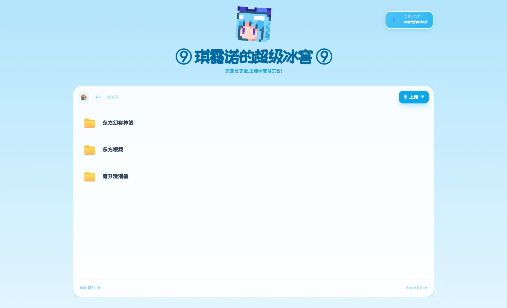
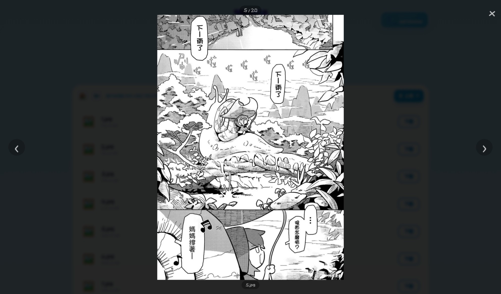
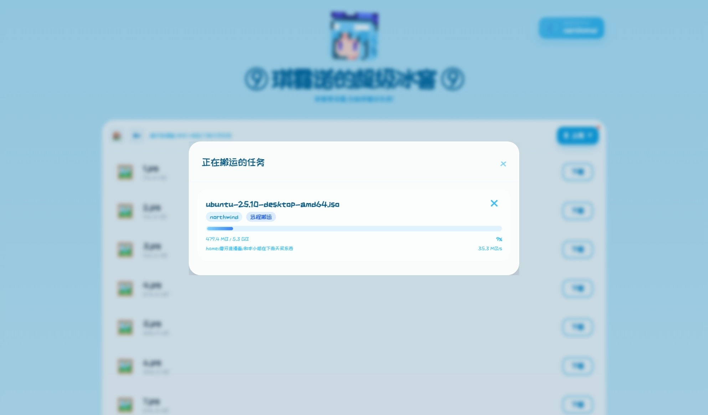

# baka-web-file-server

一个简单的自托管文件服务器，HTTPS + JWT 鉴权，支持上传、远程下载和进度追踪。提供参考配套前端，简单且易于部署。

这是类似filebrowser的go程序，可以追溯到很久以前我的一个goapi项目，目前尚在重构，正在持续更新。

前端使用了大量ai生成代码，大概40%左右，后端由我独立完成。

服务端配置了CORS中间件（需要取消program.go中间件链的注释），允许自行编写前端或者cli工具。

## 功能

- 文件浏览、上传、下载
- 远程 URL 下载到服务器
- JWT 登录鉴权 + token 续签

## 预览








## 快速开始

直接运行：

```bash
./bakaWFS
```

首次运行会在当前目录生成 `config.yaml` 和 `users.yaml`，编辑后重新启动。

启用TLS需要自己准备证书。没有启用TLS的情况下，不要在公网环境测试，极其不安全。

```yaml
cert_path: "certificate.crt" #证书
key_path:  "private.key"     #私钥
```

**必须修改的字段：**

```yaml
secret: "替换为随机字符串"   # 作为jwt的密钥
```

## 配置说明

`config.yaml`：

```yaml
address: "0.0.0.0" 
https_port: 443 # 端口设为 -1 表示关闭该协议。两者同时开启时，HTTP 会重定向到 HTTPS。
http_port:  80
secret: ""
cert_path: "certificate.crt"
key_path:  "private.key"
file_dir:   "files"
html_dir:   "built-in"       #你也可以自己写一个漂亮的前端，换成你的html文件夹路径即可（默认加载文件夹中的index.html）
temp_dir:   ".uploads"
users_file: "users.yaml"
download_workers: 2          # 并发远程下载 worker 数
```

`users.yaml`：

```yaml
users:
  - username: "baka"
    password: "bakabaka"
```

## API

| 方法 | 路径 | 说明 | 鉴权 |
|------|------|------|------|
| POST | `/login` | 登录，返回 JWT | 否 |
| POST | `/verify` | 验证并续签 token | 是 |
| GET  | `/node` | 获取文件目录树 | 否 |
| GET  | `/files/*` | 下载文件 | 否 |
| POST | `/update` | 上传文件 | 是 |
| POST | `/remote-upload` | 从 URL 下载到服务器 | 是 |
| GET  | `/progress` | 查看远程下载进度 | 是 |
| POST | `/cancel?filename=` | 取消下载任务 | 是 |

鉴权接口需在 Header 中携带 `Authorization: Bearer <token>`。

所有api格式均在dto/json中，目前api风格不一致，且缺乏文档，会持续改进。

## 项目结构

```
.
├── program.go
├── windows-terminal.go
├── config.yaml
├── users.yaml
├── internal/
│   ├── auth/        # JWT 逻辑
│   ├── config/      # 配置加载与校验
│   ├── dto/         # 数据结构
│   ├── fileutil/    # 文件工具函数
│   ├── handler/     # HTTP handler 与中间件
│   └── task/        # 任务管理与下载 worker
├── files/           # 文件存储目录
├── html/            # 前端静态文件
└── .uploads/        # 临时目录，启动时自动清理
```
## 依赖

| 依赖 | 说明 |
|---|---|
| [golang-jwt](https://github.com/golang-jwt/jwt) | 提供jwt认证 |
| [xxhash](https://github.com/cespare/xxhash) | 未实装，可能用来提供文件校验 |
| [go-colorable](https://github.com/mattn/go-colorable) | Windowscli颜色问题正在解决中 |

---

## License

MIT License © 2026 Zhang Feng